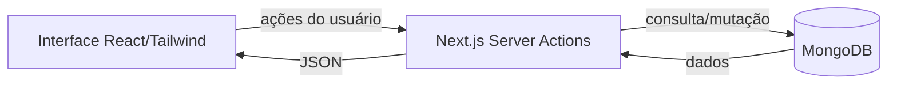

# 📋 Gerenciador de Projetos & Tarefas (Next.js + MongoDB)

Aplicação fullstack para **gerenciar projetos e tarefas** usando **Next.js 13+**, **React**, **TailwindCSS** e **MongoDB/Mongoose**.  
Inclui CRUD de tarefas, autenticação básica via segredo JWT, ícones com `lucide-react` e formatação de datas com `date-fns`.

---

## 🚀 Tecnologias usadas
- **Frontend**: Next.js (App Router) + React + TailwindCSS  
- **Backend**: Next.js Server Actions + MongoDB/Mongoose  
- **Bibliotecas auxiliares**: `lucide-react`, `date-fns`

---

## ⚙️ Instalação e execução

```bash
# 1) Clone o repositório
git clone https://seu-repo.git
cd nome-do-projeto

# 2) Instale dependências principais
npm install next react react-dom mongoose

# 3) Instale bibliotecas auxiliares
npm install lucide-react date-fns

# 4) Instale e configure o TailwindCSS
npm install -D tailwindcss postcss autoprefixer
npx tailwindcss init -p
# -> Configure o content do tailwind.config.js para a pasta app/**/*
# -> Importe as diretivas do Tailwind em styles/globals.css

# 5) Crie o arquivo .env.local (veja exemplo abaixo)
cp .env.example .env.local  # opcional, se já existir o .env.example

# 6) Rodar em desenvolvimento
npm run dev

# 7) Acesse
http://localhost:3000
```

---

## 🗝️ Exemplo de `.env.local`

```bash
MONGODB_URI=mongodb://localhost:27017/db
JWT_SECRET="SOM7HOEoTKK6q3xdmVKp0kDLi4Gh2RdJLTMh3y2iFAs=" # Added by `npx auth secret`
```

> **Observação**: nunca commite segredos reais. Use apenas em `.env.local`/variáveis de ambiente do provedor de deploy.

---

## 🧱 Modelos de dados (resumo)

### 👤 Usuario
```ts
{
  nome: String,
  email: String,
  dataNascimento: Date,
  genero: String,
  login: String,
  senha: String
}
```

### 📁 Projeto
```js
{
  idUsuario: ObjectId (ref Usuario),
  nomeProjeto: String,
  descricaoProjeto: String
}
```

### ✅ Task
```ts
{
  idProjeto: ObjectId (ref Projeto),
  nomeTarefa: String,
  descTarefa: String,
  status: String,
  prioridade: String,
  data: Date
}
```

---

## 🔗 Fluxo da aplicação



---

## 🖼️ Capturas de tela

### Login


### Registro


### Lista de Projetos


### Lista de Tarefas


---

## 🔧 Scripts sugeridos
Adicione no seu `package.json`:
```jsonc
{
  "scripts": {
    "dev": "next dev",
    "build": "next build",
    "start": "next start",
    "lint": "next lint"
  }
}
```

---

## 🌐 URL de demonstração (opcional)
Se houver deploy (Vercel/Render/Railway/etc.), informe a URL aqui.

---

## 📄 Licença
MIT (ou a de sua preferência).
