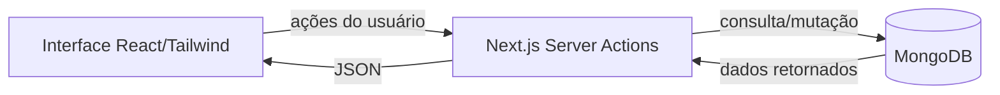

# 📋 Gerenciador de Projetos & Tarefas (Next.js + MongoDB)

Aplicação fullstack para **gerenciar projetos e tarefas** usando **Next.js 13+**, **React**, **TailwindCSS** e **MongoDB/Mongoose**.  
Inclui CRUD completo de tarefas e integração com bibliotecas como `lucide-react` (ícones) e `date-fns` (formatação de datas).

---

## 🚀 Tecnologias usadas

- **Frontend**: Next.js 13+ (App Router) + React + TailwindCSS
- **Backend**: Next.js Server Actions + MongoDB/Mongoose
- **Bibliotecas auxiliares**:
  - [`lucide-react`](https://lucide.dev/) – ícones SVG
  - [`date-fns`](https://date-fns.org/) – manipulação e formatação de datas
  - [`mongoose`](https://mongoosejs.com/) – ODM para MongoDB

---

## ⚙️ Instalação

```bash
# 1. Clone o repositório
git clone https://seu-repo.git
cd nome-do-projeto

# 2. Instale dependências principais
npm install next react react-dom mongoose

# 3. Instale bibliotecas auxiliares
npm install lucide-react date-fns

# 4. Instale e configure o TailwindCSS
npm install -D tailwindcss postcss autoprefixer
npx tailwindcss init -p
# (Configure o tailwind.config.js e globals.css conforme a doc oficial)

# 5. Crie o arquivo .env
cp .env.example .env
# Edite com suas variáveis reais (MongoDB URI, porta, etc.)

# 6. Rode em desenvolvimento
npm run dev

# 7. Acesse no navegador
http://localhost:3000
```

---

## 🧱 Modelos de Dados

### 👤 Usuario
```ts
{
  nome: String,
  email: String,
  dataNascimento: Date,
  genero: String,
  login: String,
  senha: String
}
```

### 📁 Projeto
```js
{
  idUsuario: ObjectId (ref Usuario),
  nomeProjeto: String,
  descricaoProjeto: String
}
```

### ✅ Task
```ts
{
  idProjeto: ObjectId (ref Projeto),
  nomeTarefa: String,
  descTarefa: String,
  status: String,
  prioridade: String,
  data: Date
}
```

---

## 🔗 Fluxo da Aplicação



---

## 📌 Funcionalidades
- Criar, listar, atualizar e excluir tarefas.
- Ícones interativos (`lucide-react`) para ações.
- Formatação de datas (`date-fns`).
- Interface responsiva com TailwindCSS.

---

## 📄 Licença
MIT (ou a de sua escolha).
